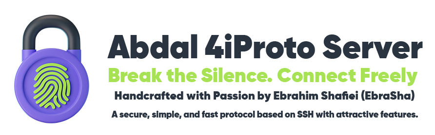

<div rtl="trl">

# سرور پروتکل 4iProto تیم ابدال

</div>

<div align="center">
  
</div>

یک سرور تونلینگ مبتنی بر SSH با کارایی بالا که برای دسترسی امن به اینترنت طراحی شده و دارای قابلیت‌های پیشرفته امنیتی و نظارت بر ترافیک است.

**📖 [English](README.md) | [فارسی](README.fa.md)**

## 🚀 قابلیت‌ها

### 🔒 ویژگی‌های امنیتی
- **محافظت داخلی در برابر حملات بروتفورس**: مسدودسازی خودکار IP پس از تلاش‌های ناموفق احراز هویت
- **نظارت بر حملات**: ثبت دقیق تلاش‌های ناموفق ورود با ردیابی IP
- **احراز هویت قابل تنظیم**: تعداد قابل تنظیم تلاش‌های حداکثر احراز هویت
- **سیستم مسدودسازی IP**: مدیریت پایدار IP های مسدود شده با ذخیره‌سازی JSON
- **سفارشی‌سازی بنر سرور**: مخفی کردن یا سفارشی‌سازی بنر سرور از طریق تنظیمات
- **تعیین سطح دسترسی**: دو حالت کاربر و مدیر دارد که مدیران قابلیت اجرای دستور در شل سیستم عامل را دارند اما کاربران فقط می توانند تونل بزنند

### 📊 نظارت بر ترافیک
- **ردیابی ترافیک آنی**: نظارت بر استفاده آپلود/دانلود برای هر کاربر
- **آمار مبتنی بر جلسه**: ردیابی بایت‌های ارسال/دریافت شده در هر جلسه
- **تحلیل استفاده کل**: آمار ترافیک تجمعی در تمام جلسات
- **ذخیره‌سازی خودکار داده**: ذخیره داده‌های ترافیک در فایل‌های JSON هر 10 ثانیه
- **نظارت آنی پهنای باند**: نمایش استفاده پهنای باند به صورت آنی
- **مسدود سازی سایت های غیر مجاز**:سایت هایی که نمی خواهید کاربر بازدید کند را مسدود می کند
- **مسدود سازی آی پی های غیر مجاز**:آی پی هایی که نمی خواهید کاربر بازدید کند را مسدود می کند
- **ردیابی سایت های بازدید شده**:قابلیت ردیابی سایت های بازدید شده توسط کاربر ، که می توانید این قابلیت را برای هر کابری فعال یا غیر فعال کنید

### 🌐 قابلیت‌های شبکه
- **پشتیبانی چند پورت**: اجرای سرور روی چندین پورت به صورت همزمان
- **فورواردینگ TCP**: فورواردینگ مستقیم اتصال TCP بدون تنظیمات اضافی
- **فورواردینگ UDP**: پشتیبانی کامل فورواردینگ ترافیک UDP
- **چند پلتفرمی**: اجرا روی سیستم‌های لینوکس و ویندوز
- **کارایی بالا**: 10 برابر سریع‌تر از OpenSSH برای عملیات تونلینگ

### 🛠️ ویژگی‌های مدیریتی
- **مدیریت کاربران**: سیستم احراز هویت مبتنی بر JSON
- **ادغام شل**: پشتیبانی بومی CMD در ویندوز و Shell در لینوکس
- **مدیریت تنظیمات**: تنظیمات سرور مبتنی بر JSON
- **سیستم ثبت**: ثبت جامع اتصالات و حملات

## 📋 نیازمندی‌ها

- Go 1.19 یا بالاتر
- کلید خصوصی SSH (`id_rsa`)
- فایل‌های تنظیمات (به بخش راه‌اندازی مراجعه کنید)

## ⚙️ راه‌اندازی

### 1. فایل‌های تنظیمات

#### Windows

```json


{
  "ports": [64235, 64236,64237],
  "shell": "cmd.exe",
  "max_auth_attempts": 3,
  "server_version": "SSH-2.0-Abdal-4iProto-Server"
}
```
#### linux

```json
{
  "ports": [64235, 64236,64237],
  "shell": "/bin/bash",
  "max_auth_attempts": 3,
  "server_version": "SSH-2.0-Abdal-4iProto-Server"
}
```


#### `users.json`

```json

[
  {
    "username": "ebrasha",
    "password": "152314562152",
    "role": "admin",
    "blocked_domains": [],
    "blocked_ips": [],
    "log": "no"
  },
  {
    "username": "user1",
    "password": "password123",
    "role": "user",
    "blocked_domains": [
      "facebook.com",
      "*.facebook.com",
      "twitter.com",
      "*.twitter.com",
      "instagram.com",
      "*.instagram.com"
    ],
    "blocked_ips": [
      "192.168.1.100",
      "10.0.0.*",
      "172.16.*.*"
    ],
    "log": "yes"
  },
  {
    "username": "user2",
    "password": "password456",
    "role": "user",
    "blocked_domains": [
      "youtube.com",
      "*.youtube.com",
      "netflix.com",
      "*.netflix.com"
    ],
    "blocked_ips": [
      "192.168.10.1",
      "10.10.10.10"
    ],
    "log": "yes"
  }
]

```

#### `blocked_ips.json`

```json
{
  "blocked": [
    "192.168.1.12",
    "10.0.0.7"
  ]
}
```

### 2. تنظیم کلید SSH
کلید خصوصی SSH خود را به عنوان `id_rsa` در دایرکتوری پروژه قرار دهید.

برای تولید کلید تازه در سرور  در محل فایل های سرور دستور زیر را اجرا کنید.

```bash
ssh-keygen -t rsa -b 4096 -f id_rsa
```

### 3. ساخت و اجرا
```bash
go mod tidy
go build -o abdal-4iproto-server
./abdal-4iproto-server
```

## 📁 ساختار فایل‌ها

```
abdal-4iproto-server/
├── main.go                 # برنامه اصلی سرور
├── server_config.json      # تنظیمات سرور
├── users.json             # اطلاعات کاربران
├── id_rsa                 # کلید خصوصی SSH
├── blocked_ips.json       # آدرس‌های IP مسدود شده
├── invalid_logins.log     # تلاش‌های ناموفق ورود
└── traffic_*.json         # آمار ترافیک هر کاربر
```

## 🔧 گزینه‌های تنظیمات

### تنظیمات سرور (`server_config.json`)
- `ports`: آرایه‌ای از پورت‌هایی که سرور روی آن‌ها گوش می‌دهد
- `shell`: دستور شل برای اجرا (cmd.exe برای ویندوز، /bin/bash برای لینوکس)
- `max_auth_attempts`: حداکثر تلاش‌های ناموفق ورود قبل از مسدودسازی IP
- `server_version`: رشته نسخه سفارشی سرور SSH

### نظارت بر ترافیک
سرور به طور خودکار ردیابی می‌کند:
- بایت‌های ارسال/دریافت شده در هر جلسه
- ترافیک کل برای هر کاربر
- برچسب‌های زمانی جلسه
- استفاده آنی پهنای باند

## 🚀 استفاده


### شروع سرور
```bash
./abdal-4iproto-server
```

### اتصال از طریق کلاینت اختصاصی
ما یک کلاینت اختصاصی با رابط گرافیکی ساخته‌ایم که از ایجاد سرور SOCKS5 نیز پشتیبانی می‌کند. برای بهترین تجربه، از کلاینت اختصاصی ما استفاده کنید:

**دانلود کلاینت**: [کلاینت ابدال 4iProto](https://github.com/ebrasha/abdal-4iproto-client)

### جایگزین: اتصال SSH استاندارد
```bash
ssh -D 1080 username@server_ip -p 22
```

### استفاده از پروکسی SOCKS
پس از برقراری اتصال با فورواردینگ دینامیک:
- برنامه‌ها را برای استفاده از پروکسی SOCKS روی localhost:1080 تنظیم کنید
- تمام ترافیک از طریق اتصال امن SSH تونل خواهد شد

## 📊 نظارت

### آمار ترافیک
داده‌های ترافیک به طور خودکار در فایل‌های `traffic_username.json` ذخیره می‌شوند:
```json
{
  "username": "user1",
  "ip": "192.168.1.100",
  "last_bytes_sent": 1024,
  "last_bytes_received": 2048,
  "total_bytes_sent": 1048576,
  "total_bytes_received": 2097152,
  "total_bytes": 3145728,
  "last_timestamp": "2025-01-15T10:30:00Z"
}
```

### فایل‌های ثبت
- `invalid_logins.log`: ثبت تلاش‌های ناموفق احراز هویت
- `blocked_ips.json`: مدیریت آدرس‌های IP مسدود شده
- خروجی کنسول: ثبت‌های آنی اتصال و ترافیک

## 🔒 ویژگی‌های امنیتی

### محافظت در برابر بروتفورس
- مسدودسازی خودکار IP پس از تلاش‌های ناموفق قابل تنظیم
- ذخیره‌سازی پایدار IP های مسدود شده
- ثبت دقیق حملات با برچسب‌های زمانی

### نظارت بر حملات
- ثبت تلاش‌های ناموفق ورود با نام کاربری، رمز عبور و IP
- ردیابی الگوهای حمله و منابع
- ارائه تحلیل‌های جامع امنیتی

## 🐛 گزارش مشکلات
اگر با مشکلی مواجه شدید یا در پیکربندی مشکل دارید، لطفاً از طریق ایمیل Prof.Shafiei@Gmail.com با ما در تماس باشید. همچنین می‌توانید مشکلات را در GitLab یا GitHub گزارش دهید.

## ❤️ حمایت مالی
اگر این پروژه برای شما مفید بود و مایل به حمایت از توسعه بیشتر هستید، لطفاً در نظر داشته باشید که کمک مالی کنید:
- [اینجا اهدا کنید](https://alphajet.ir/abdal-donation)

## 🤵 برنامه‌نویس
ساخته شده با عشق توسط **ابراهیم شفیعی (EbraSha)**
- **ایمیل**: Prof.Shafiei@Gmail.com
- **تلگرام**: [@ProfShafiei](https://t.me/ProfShafiei)

## 📜 مجوز
این پروژه تحت مجوز GPLv2 or later منتشر شده است. 