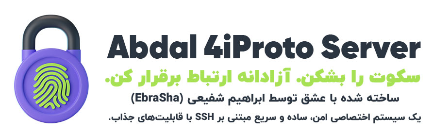

# سرور 4iProto تیم ابدال

  

یک سرور تونلینگ مبتنی بر SSH با کارایی بالا که برای دسترسی امن به اینترنت طراحی شده و دارای قابلیت‌های پیشرفته امنیتی و نظارت بر ترافیک است.

**📖 [English](README.md) | [فارسی](README.fa.md)**

## 📚 مستندات

نصب، پیکربندی، قابلیت‌ها، کلاینت‌ها، مانیتورینگ و راهنماهای کامل در این آدرس در دسترس است:

- 📘 **[مستندات رسمی](https://ebrasha.github.io/abdal-4iproto-server/)**

## 🚀 قابلیت‌ها

### 🔒 ویژگی‌های امنیتی
- **محافظت داخلی در برابر حملات بروتفورس**: مسدودسازی خودکار IP پس از تلاش‌های ناموفق احراز هویت
- **نظارت بر حملات**: ثبت دقیق تلاش‌های ناموفق ورود با ردیابی IP
- **احراز هویت قابل تنظیم**: تعداد قابل تنظیم تلاش‌های حداکثر احراز هویت
- **سیستم مسدودسازی IP**: مدیریت پایدار IP های مسدود شده با ذخیره‌سازی JSON
- **سفارشی‌سازی بنر سرور**: مخفی کردن یا سفارشی‌سازی بنر سرور از طریق تنظیمات
- **تعیین سطح دسترسی**: دو حالت کاربر و مدیر دارد که مدیران قابلیت اجرای دستور در شل سیستم عامل را دارند اما کاربران فقط می توانند تونل بزنند

### 📊 نظارت بر ترافیک
- **ردیابی ترافیک آنی**: نظارت بر استفاده آپلود/دانلود برای هر کاربر
- **آمار مبتنی بر جلسه**: ردیابی بایت‌های ارسال/دریافت شده در هر جلسه
- **تحلیل استفاده کل**: آمار ترافیک تجمعی در تمام جلسات
- **ذخیره‌سازی خودکار داده**: ذخیره داده‌های ترافیک در فایل‌های JSON هر 10 ثانیه
- **نظارت آنی پهنای باند**: نمایش استفاده پهنای باند به صورت آنی
- **مسدود سازی سایت های غیر مجاز**:سایت هایی که نمی خواهید کاربر بازدید کند را مسدود می کند
- **مسدود سازی آی پی های غیر مجاز**:آی پی هایی که نمی خواهید کاربر بازدید کند را مسدود می کند
- **ردیابی سایت های بازدید شده**:قابلیت ردیابی سایت های بازدید شده توسط کاربر ، که می توانید این قابلیت را برای هر کابری فعال یا غیر فعال کنید

### 🌐 قابلیت‌های شبکه
- **پشتیبانی چند پورت**: اجرای سرور روی چندین پورت به صورت همزمان
- **فورواردینگ TCP**: فورواردینگ مستقیم اتصال TCP بدون تنظیمات اضافی
- **فورواردینگ UDP**: پشتیبانی کامل فورواردینگ ترافیک UDP
- **چند پلتفرمی**: اجرا روی سیستم‌های لینوکس و ویندوز
- **کارایی بالا**: 10 برابر سریع‌تر از OpenSSH برای عملیات تونلینگ
- **پشتیبانی از DNSTT**: تونل‌زنی پیشرفته ترافیک شبکه از طریق پروتکل DNS

### 🛠️ ویژگی‌های مدیریتی
- **مدیریت کاربران**: سیستم احراز هویت مبتنی بر JSON
- **ادغام شل**: پشتیبانی بومی CMD در ویندوز و Shell در لینوکس
- **مدیریت تنظیمات**: تنظیمات سرور مبتنی بر JSON
- **سیستم ثبت**: ثبت جامع اتصالات و حملات

## 🧾 قابلیت های اکانتینگ
- **کنترل داخلی سشن‌ها**: مدیر می‌تواند حداکثر تعداد سشن‌های فعال همزمان برای هر حساب را تنظیم کند تا میزان اتصال کاربران کنترل شود.
- **انقضای خودکار سشن‌ها**: برای هر سشن مدت زمان اعتبار (TTL) تعریف می‌شود تا پس از پایان آن، سشن منقضی شده و منابع آزاد شوند.
- **مدیریت پویا در زمان محدودیت**: وقتی تعداد سشن‌ها به حد مجاز برسد، اتصال‌های جدید می‌توانند رد شوند یا در صف انتظار قرار گیرند (قابل تنظیم توسط مدیر).
- **مسدودسازی فوری اتصال‌های جدید در صورت اشباع سشن‌ها**: در صورتی که یک حساب از سقف مجاز سشن عبور کرده باشد، کاربران جدیدی که قصد اتصال دارند از همان ابتدا مسدود شده و اجازه ورود نخواهند داشت.
- **نظارت لحظه‌ای بر سشن‌ها**: سیستم وضعیت سشن‌های فعال را به‌صورت زنده ثبت کرده و برای حسابرسی و تحلیل ذخیره می‌کند.
- **محدودیت سرعت (Rate Limiting)**: امکان تعریف حداکثر سرعت انتقال داده برای هر کاربر با فیلد `max_speed_kbps` بر حسب کیلوبایت بر ثانیه. این محدودیت به‌صورت برخط و در هر دو جهت (Upload/Download) با الگوریتم Token Bucket اعمال می‌شود.  
  **📌 مثال**: `1024` = معادل 1 مگابایت بر ثانیه

- **محدودیت حجم مصرفی (Traffic Limit)**: امکان تعیین سقف حجم مصرفی برای هر کاربر با فیلد `max_total_mb` بر حسب مگابایت. در صورت عبور از سقف، اتصال هنگام ورود رد می‌شود یا در حین استفاده قطع خواهد شد.  
  **📌 مثال**: `10240` = معادل 10 گیگابایت

- **بررسی و اعمال برخط محدودیت حجم**: هر ۱ تا ۲ ثانیه ترافیک مصرفی بررسی می‌شود. در صورت عبور از محدودیت، اتصال بلافاصله قطع و دسترسی غیرفعال می‌گردد.

## 🚀 نصب آسان از طریق ابزار Abdal 4iProto Cli

پروژه [**Abdal 4iProto Cli**](https://github.com/ebrasha/abdal-4iproto-cli) یک ابزار پیشرفته خط فرمان برای مدیریت جامع اکوسیستم Abdal 4iProto است. این ابزار به طور خودکار مشخصات سیستم‌عامل و معماری پردازنده شما را تشخیص داده، اصالت فایل‌ها را با هش SHA-256 اعتبارسنجی می‌کند، پورت‌ها را تنظیم کرده، کلید SSH می‌سازد، سرویس‌های سیستمی پایدار را ثبت می‌نماید و می‌تواند [**پنل گرافیکی Abdal 4iProto Panel**](https://github.com/ebrasha/abdal-4iproto-panel) را نصب کند تا کاربران و کل تنظیمات سرور را به‌صورت گرافیکی مدیریت کنید.

برای مراحل کامل نصب، پیکربندی، کلاینت‌ها و راهنماها به 📘 **[مستندات رسمی](https://ebrasha.github.io/abdal-4iproto-server/)** مراجعه کنید.

## 🐛 گزارش مشکلات
اگر با مشکلی مواجه شدید یا در پیکربندی مشکل دارید، لطفاً از طریق ایمیل Prof.Shafiei@Gmail.com با ما در تماس باشید. همچنین می‌توانید مشکلات را در GitHub گزارش دهید.

## ❤️ حمایت مالی
اگر این پروژه برای شما مفید بود و مایل به حمایت از توسعه بیشتر هستید، لطفاً در نظر داشته باشید که کمک مالی کنید:
- [اینجا اهدا کنید](https://t.me/AbdalDonationBot)

## 🤵 برنامه‌نویس
ساخته شده با عشق توسط **ابراهیم شفیعی (EbraSha)**
- **ایمیل**: Prof.Shafiei@Gmail.com
- **تلگرام**: [@ProfShafiei](https://t.me/ProfShafiei)

## 📜 مجوز
این پروژه تحت مجوز GPLv2 or later منتشر شده است.
